<picture>
  <source media="(prefers-color-scheme: dark)" srcset="banner_dark.svg">
  <source media="(prefers-color-scheme: light)" srcset="banner_light.svg">
  
</picture>

 

<!-- ==================== PHASE 2: STATS ==================== -->

  

  

  
  

<!-- ==================== PHASE 3: SNAKE ==================== -->

  <picture>
    <source media="(prefers-color-scheme: dark)" srcset="https://raw.githubusercontent.com/bishirkdy/bishirkdy/output/snake-dark.svg">
    <source media="(prefers-color-scheme: light)" srcset="https://raw.githubusercontent.com/bishirkdy/bishirkdy/output/snake-light.svg">
    
  </picture>

<!-- ==================== PHASE 4: BADGES ==================== -->

  
  &nbsp;&nbsp;
  

Content
